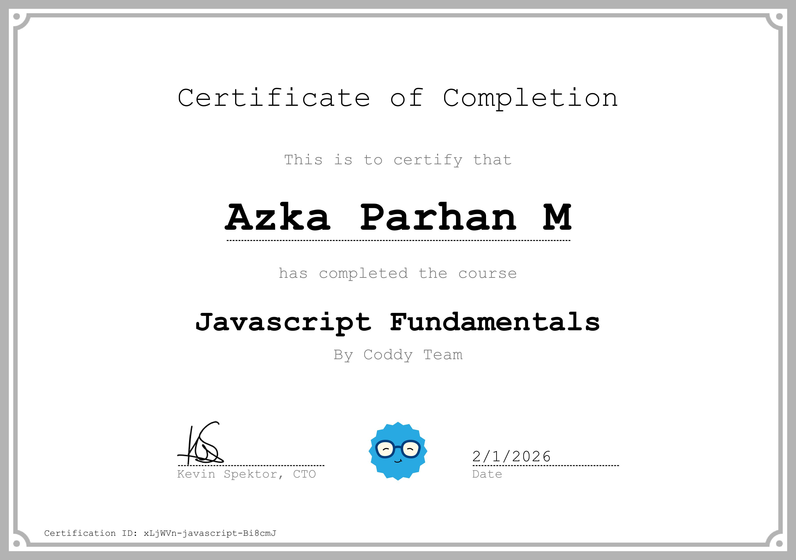
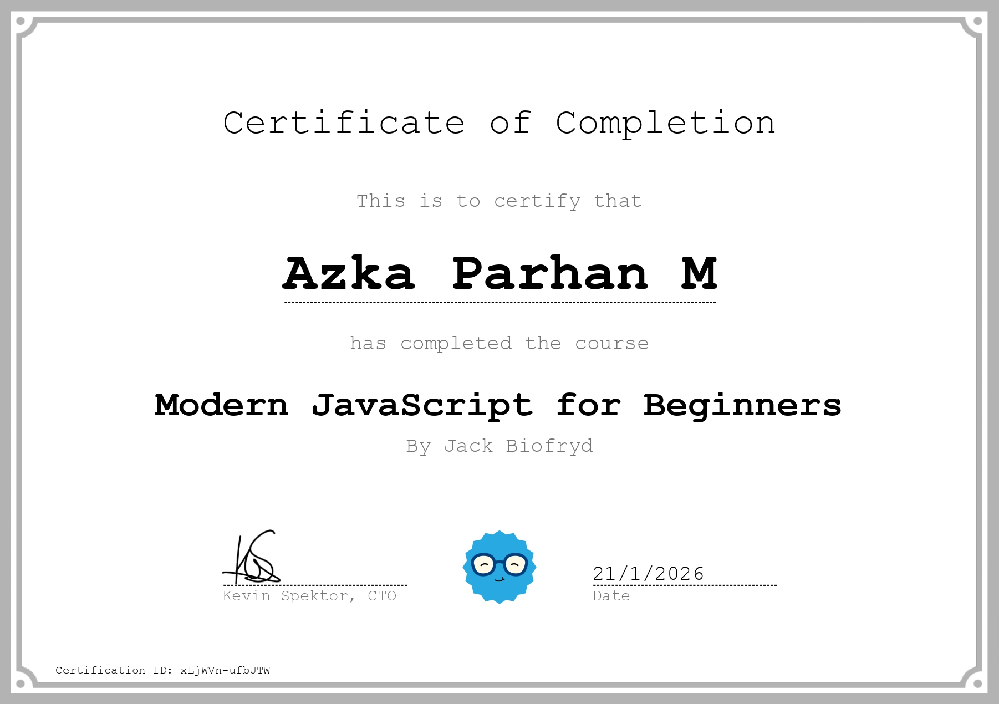
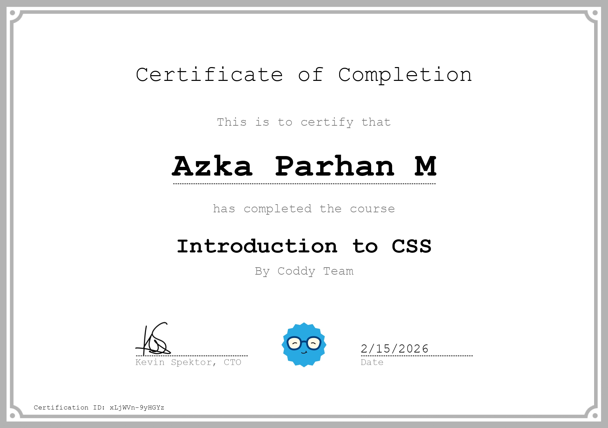

# Hi, I'm Azka Parhan M 👋

I am a self-taught learner who is deeply passionate about technology and programming. For me, every line of code is a new adventure, and I truly enjoy the process of learning something new every single day.

## 🏆 Learning Certifications
I document my learning journey here to stay motivated and keep growing:

### 📑 Web Development Fundamentals
* **HTML Fundamentals**

### ⚙️ JavaScript Journey
* **JavaScript Fundamentals**

* **Modern JavaScript for Beginners**

### 🎨 CSS & Design Journey
* **CSS Fundamentals**

* [March 15, 2026] Reading YDKJS: Understanding the core philosophy of what JavaScript really is.
* [March 16, 2026] Learning JS Fundamentals: Mastered the concept of Values (Strings, Numbers, and Booleans) and improved my technical English.
* [March 17, 2026] Multi-language expansion: Starting my Python journey while continuing JavaScript deep dives.
* [March 17, 2026] Python Debugging: Fixed my first SyntaxError (unterminated string literal) and learned the importance of closing quote marks.
* [March 18, 2026] Python Day 2: Understanding Variables, using built-in functions like len() and type(), and learning snake_case naming conventions.
* [March 19, 2026] HTML Fundamentals: Learned about Form structures, Labels, and different Input types for user interaction.
* [March 19, 2026] HTML Form Mastery: Learned the three types of buttons (Submit, Reset, and Button) and their specific functional roles.
* [March 19, 2026] JS Deep Dive: Learning Chapter 2 of YDKJS - Understanding Values, Variables (let vs const), Functions, and Strict Equality.
* [March 19, 2026] Python Logic: Learned about Explicit Type Conversion (Casting) using str() and the difference between Python and JavaScript concatenation.
* [March 20, 2026] Python Logic Mastery: Learned Nested if-else structures to handle multi-level decision making and practiced proper indentation.
* [March 20, 2026] HTML Form Security: Learned about Client-side Validation and how attributes like 'required' and 'pattern' improve user experience and data accuracy.
* [March 20, 2026] UI/UX Fundamentals: Learned about Form States (Default, Focus, Error, and Success) and how they guide the user through a for
* [March 20, 2026] JS Deep Dive: Explored YDKJS Chapter 3 - Mastering Iterators, Closures, Prototypes, and the Prototype Chain mechanism.
* [March 20, 2026] Python Day 3: Mastering Operators - Practiced Arithmetic, Comparison, and Logical operations, including Modulus (%) and Floor Division (//).
* [March 21, 2026] Python Interaction: Learned how to use the input() function to capture user data and practiced Type Casting to handle numerical inputs.
---
*"Keep learning, keep creating, and stay inspired!"*
