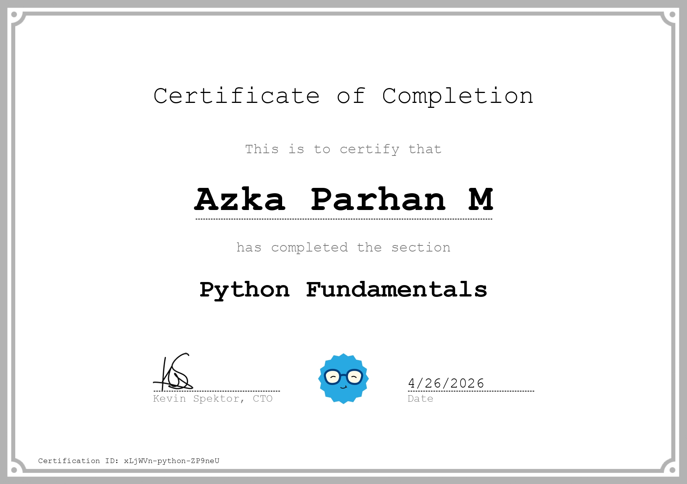

# Hi, I'm Azka Parhan M 👋

I am a self-taught learner who is deeply passionate about technology and programming. For me, every line of code is a new adventure, and I truly enjoy the process of learning something new every single day.

## 🏆 Learning Certifications
I document my learning journey here to stay motivated and keep growing:

## 🎓 My Learning Journey: Certifications

| JavaScript Fundamentals | Modern JS for Beginners | HTML Fundamentals (Old) | |
| :---: | :---: | :---: | :---: |
|  |  |  | |

| Introduction to CSS | Python Fundamentals | HTML Fundamental (New) | Next Goal |
| :---: | :---: | :---: | :---: |
|  |  |  | ✨ *Keep Learning* |

* [March 15, 2026] Reading YDKJS: Understanding the core philosophy of what JavaScript really is.
* [March 16, 2026] Learning JS Fundamentals: Mastered the concept of Values (Strings, Numbers, and Booleans) and improved my technical English.
* [March 17, 2026] Multi-language expansion: Starting my Python journey while continuing JavaScript deep dives.
* [March 17, 2026] Python Debugging: Fixed my first SyntaxError (unterminated string literal) and learned the importance of closing quote marks.
* [March 18, 2026] Python Day 2: Understanding Variables, using built-in functions like len() and type(), and learning snake_case naming conventions.
* [March 19, 2026] HTML Fundamentals: Learned about Form structures, Labels, and different Input types for user interaction.
* [March 19, 2026] HTML Form Mastery: Learned the three types of buttons (Submit, Reset, and Button) and their specific functional roles.
* [March 19, 2026] JS Deep Dive: Learning Chapter 2 of YDKJS - Understanding Values, Variables (let vs const), Functions, and Strict Equality.
* [March 19, 2026] Python Logic: Learned about Explicit Type Conversion (Casting) using str() and the difference between Python and JavaScript concatenation.
* [March 20, 2026] Python Logic Mastery: Learned Nested if-else structures to handle multi-level decision making and practiced proper indentation.
* [March 20, 2026] HTML Form Security: Learned about Client-side Validation and how attributes like 'required' and 'pattern' improve user experience and data accuracy.
* [March 20, 2026] UI/UX Fundamentals: Learned about Form States (Default, Focus, Error, and Success) and how they guide the user through a for
* [March 20, 2026] JS Deep Dive: Explored YDKJS Chapter 3 - Mastering Iterators, Closures, Prototypes, and the Prototype Chain mechanism.
* [March 20, 2026] Python Day 3: Mastering Operators - Practiced Arithmetic, Comparison, and Logical operations, including Modulus (%) and Floor Division (//).
* [March 21, 2026] Python Interaction: Learned how to use the input() function to capture user data and practiced Type Casting to handle numerical inputs.
* [March 21, 2026] JS Architecture: Explored YDKJS Chapter 4 - Understanding the Three Pillars of JS: Scope/Closures, Prototypes, and Types/Coercion.
* [March 21, 2026] Python Day 4: Mastered String manipulation, including Escape Sequences, Indexing (starting at 0), Slicing, and common String Methods.
* [March 24, 2026] Python Formatting: Finished the Formatted Output module. Mastered f-strings for cleaner, more readable code.
* [March 24, 2026] Environment Setup: Successfully configured Git and PowerShell on a new device. Resolved credential conflicts and synced local workspace with GitHub.
* [March 25, 2026] Control Flow: Mastered While Loops. Learned how to repeat blocks of code based on conditions and how to use incrementing variables.
* [March 25, 2026] Data Structures: Completed Day 5. Learned about Lists, indexing (starting at 0), and list methods like len().
* [March 25, 2026]
    * **JavaScript (YDKJS):** Successfully graduated from **Book 1: Get Started**. 🎓
    * **JavaScript (Book 2):** Started **Chapter 1: Scope & Closures**. Learned about "Rules for Looking" and Global vs. Local scope.
* [March 26, 2026] Control Flow: Learned the "continue" statement. Understood how to skip specific iterations in a loop.
* [March 27, 2026] Loops: Mastered the range() function. Learned about Start, Stop, and Step parameters for number generation.
* [March 28, 2026] Loops: Mastered the range() function. Learned about Start, Stop, and Step parameters for generating number sequences.
* [March 30, 2026] Python Fundamentals: Completed the Recap on Dynamic Input. Mastered combining input(), type conversion, and f-strings.
* [March 30, 2026] **Environment Setup:** Successfully installed **Python 3.14.3** and configured the `py` launcher on Windows 11. 🛠️
* [March 31, 2026] **Data Structures:** Completed Day 5 Lists. Practiced append(), len(), and indexing in Python 3.14.

### Learning Progression: April 2026
* [April 01, 2026] **Coddy Tech:** Finished "Declare a Function". Learned about def, parameters, and how to create reusable code blocks.
* [April 01, 2026] **JavaScript (YDKJS):** Started Chapter 2 "Surveying JS". Learned about Variables, Types, Conditionals, and Loops.
* [April 02, 2026] **Coddy Tech (Arguments):** Learned how to pass information into functions. Practiced using positional and keyword arguments to make code more flexible.
* [April 02, 2026] **JavaScript (YDKJS):** Finished Ch 2 (Surveying JS) and started Ch 3 (Digging to the Roots). Learned about Iterators, Closures, and Prototypes.
* [April 03, 2026] **Coddy Tech (Return & Return Mastery):** Mastered how functions send data back using `return`. Learned the difference between "Showing" (print) and "Giving" (return).
* [April 04, 2026] **Coddy Tech (Default Values):** Learned how to set "Backup" values for function parameters. This makes functions more flexible and prevents errors when arguments are missing.
* [April 05, 2026] **Python Fundamentals (Coddy):** COMPLETED! 
  * Mastered: Variables, Data Types, Conditionals, Loops, and Function Return Mastery.
  * Next Goal: Advanced Python structures and real-world projects.
* [April 06, 2026] **Coddy Tech:** Finished the entire "Python Fundamentals" journey. (Topics: Variables, Returns, and Default Values).
* [April 08, 2026] **Day 10 (List Accessing):** Learned about zero-based indexing and accessing elements from a list using both positive and negative indices. 
  * Concept: `list[0]` for the first item, `list[-1]` for the last item.
  * Practice: Created `day_10_list_access.py`.
* [April 09, 2026] **Python Mastery:** Completed the "Accessing List Elements Mastery" lesson on Coddy.tech. Gained full understanding of positive and negative indexing.
*"Keep learning, keep creating, and stay inspired!"*
* [April 10, 2026] **Python Mastery:** Completed "Modifying Lists Mastery" on Coddy.tech. Learned how to update and change specific elements in a list using index assignment.
* [April 12, 2026] **Python Mastery:** Completed "List Methods Mastery" on Coddy.tech. Learned how to use `.append()`, `.insert()`, `.pop()`, and `.sort()` to manage data dynamically.
* [April 13, 2026] **Python Fundamentals:** Completed "Tuples" and "Recap: Reversed List" on Coddy.tech.
* Learned how to use **Tuples** for data that shouldn't change (immutability).
* Mastered reversing lists using `.reverse()`.
* [April 14, 2026] **Python Fundamentals:** Completed "Iterating Over Elements" on Coddy.tech. Learned how to use `for` loops to access and process every item in a list efficiently.
* [April 15, 2026] **Python Fundamentals:** Completed "The Enumerate Function" on Coddy.tech. Learned how to use `enumerate()` to track both the index and the value of elements during a loop.
* [April 18, 2026] **Python Fundamentals:** Completed "Iterating Over Strings Part 2" on Coddy.tech.
* [April 19, 2026] **Python Fundamentals:** Completed "List Slicing Part 1" on Coddy.tech.
* [April 20, 2026] **Python Fundamentals:** Completed "List Slicing Part 2" on Coddy.tech. 
* Learned the full slicing syntax: `list[start:stop:step]`.
* [April 21, 2026] **Python Fundamentals:** Completed "Sequence Operators" on Coddy.tech. 
* Learned how to use `+` to concatenate and `*` to repeat sequences.
* [April 22, 2026] **Python Fundamentals:** Completed "Membership Operators" on Coddy.tech.
* [April 23, 2026] **Python Fundamentals:** Completed "Add Expense" project on Coddy.tech. 
* Applied list manipulation skills to build a functional expense tracker.
* [April 24, 2026] **Python Fundamentals:** Completed "View All Expenses" project on Coddy.tech.
* [April 25, 2026] **Python Fundamentals:** Completed "Handling Errors" on Coddy.tech.
* [April 26, 2026] **Python Fundamentals:** Completed "What to Buy" project on Coddy.tech.
* [April 27, 2026] **Python Logic & Flow:** Completed "Multiple Variable Assignments" on Coddy.tech. 
* Learned how to assign multiple values to multiple variables in a single line.
* [April 28, 2026] **Python Logic & Flow:** Completed "Round Numbers Mastery" on Coddy.tech. 
* Learned how to use the built-in `round()` function to manage numerical precision.
* [April 28, 2026] **Python Logic & Flow:** Completed "Rounding Numbers" on Coddy.tech. 
* Learned to use the `round()` function to control decimal precision.
* [April 29, 2026] **Git Mastery:** Successfully resolved a merge conflict and optimized the GitHub profile gallery layout.
* [April 30, 2026] Introduction to Dictionaries
* Learned to store data using **Key-Value pairs** for faster and more logical data retrieval

### 🐍 Python Progression: May 2026
* [May 2, 2026] Modifying Dictionaries
* Learned to update existing values and add new key-value pairs to an existing dictionary.
* [May 3, 2026] Python Dictionary Methods
* Learned essential methods like `.keys()`, `.values()`, and `.items()` to extract data.
* Learned to use `.get()` for safe data retrieval without causing program crashes (errors).
* Practiced `.clear()` and `.copy()` to manage dictionary data efficiently.
* [May 5, 2026] Python Logic: Frequency Counter Recap
* Learned the "Frequency Counter" pattern to count occurrences of items within a collection.
* Integrated loops with dictionary logic to dynamically build and update data sets.
* [May 6, 2026] Python Project: Add Contact System
* Built a functional contact management script using Python dictionaries.
* Implemented logic to check for existing entries to prevent duplicate data.
* [May 7, 2026] Python Logic: Iterating Through Dictionaries
* Mastered the `for key, value in dict.items()` pattern to "List All" data entries efficiently.
* Learned to separate data logic from display logic for cleaner, more readable output.
* [May 8, 2026] Python Logic: Ternary Operators
* Learned to use conditional expressions (Ternary Operators) to write concise one-line `if/else` statements.
* Mastered the syntax: `value_if_true if condition else value_if_false`.
* [May 9, 2026] Python Logic: Identity Checks (`is` vs `==`)
* Learned the critical difference between value equality (`==`) and object identity (`is`).
* Explored how Python stores objects in memory and how to verify if two variables point to the exact same memory address.
* practiced the use of the `id()` function to inspect the unique identity of objects.
* Understood "Integer Interning" and how Python optimizes small, frequently used objects in the background.
* [May 10, 2026] Python Project: Vacation Filter Recap
* Developed a filtering system to process complex datasets using dictionary iteration.
* Implemented logic to extract specific entries based on multiple criteria (budget, location, and availability).
* Refined skills in dynamic list building by appending filtered results from a master dictionary.
* [May 11, 2026] Python Sets: Basic Operations
* Explored **Sets** as a data structure for storing unique, unordered collections.
* Learned set operations including `.add()` for new elements and `.remove()` / `.discard()` for deletion.
* Learned to use the `set()` constructor to instantly remove duplicates from existing lists.
* Understood the performance benefits of sets for membership testing (checking if an item exists).
* [May 12, 2026] Python Sets: Mathematical Operations (Part 1)
* Mastered **Union (`|`)**: Combining two sets to get all unique elements from both.
* Mastered **Intersection (`&`)**: Finding only the elements that exist in both sets.
* Learned to use both operator syntax (`|`, `&`) and method syntax (`.union()`, `.intersection()`).
* Applied set logic to solve data comparison problems efficiently.
* [May 13, 2026] Python Project: Treasure Hunt Recap
* Applied advanced **Set Operations** to solve a logic-based search algorithm.
* learned **Set Difference (`-`)** and **Symmetric Difference (`^`)** to isolate unique elements between data sets.
* Combined multiple set methods to filter out "false leads" and identify the "treasure" (target data).
* Demonstrated the ability to use mathematical set theory for efficient code execution.
* [May 15, 2026] Python Logic: Iterating Over Sets Mastery
* learned the ability to loop through **Sets** using the `for` in loop.
* Deepened understanding of "Unordered Collections" and why index-based access is not possible in sets.
* Practiced transforming set data during iteration to perform bulk updates and checks.
* Applied set iteration logic to filter unique data points in real-world scenarios.
* [May 16, 2026] Python: Logic & Flow Project Capstone Overview
* Commenced the final project phase integrating all core Python data structures and flow control systems.
* Designed the architecture for a comprehensive application combining Dictionaries, Sets, and multi-layered Loops.
* [May 17, 2026] Python Project: Student Grade Management System
* Mastered **Nested Data Structures** by mapping list collections as values within a dictionary.
* Implemented logic to safely check for existing student keys before dynamically appending new numerical grades.
* [May 18, 2026] Python Project: Grade Average Calculator
* Implemented data analysis logic to calculate numerical averages from nested list data.
* practiced combining built-in functions like `sum()` and `len()` to process collections dynamically.
* [May 19, 2026] Python Project: Top Students Tracker
* Developed an optimization and filtering script to identify high-performing records within a dataset.
* Implemented threshold-based conditional checks to filter entries based on numerical score criteria.
* [May 20, 2026] Python Logic: Built-in `sum()` Function
* Learned to use the built-in `sum()` function to calculate totals of numeric collections efficiently.
* Explored the `start` parameter within `sum(iterable, start)` to add a baseline value to the total.
* [May 21, 2026] Python Logic: Sorting Data Efficiently
* Mastered the use of `sorted()` and `.sort()` to organize collections in ascending and descending order.
* Explored the critical difference between in-place sorting (`.sort()`) and return-copy sorting (`sorted()`).
* Utilized the `reverse=True` parameter to easily flip the order of sorted datasets.
* Applied sorting mechanisms to handle numerical data and prepare collections for clean presentation.
* [May 22, 2026] Python Project: Dictionary Sorter Recap
* Applied advanced sorting mechanisms to order complex dictionary structures dynamically.
* Leveraged custom sorting keys (`key=lambda item: ...`) to isolate specific dictionary properties for evaluation.
* [May 23, 2026] Python Fundamentals: Creating Simple Lists
* Learned to define and initialize **Lists** as ordered, mutable collections of items.
* Practiced list syntax using square brackets `[]` and separating elements with commas.
* Explored how lists can store multiple data types simultaneously (strings, integers, floats).
* Understood the concept of collection-based storage for managing groups of related data efficiently.
* [May 24, 2026] Python Logic: Data Aggregation Techniques
* Learned the core concepts of data aggregation to transform granular datasets into meaningful high-level summaries.
* Practiced combining iteration logic with multiple mathematical metrics (totals, counts, and conditions) simultaneously.
* Developed structured statistical logic to evaluate collections without relying on multiple separate loops.
* Strengthened the ability to generate clean dashboard-style metrics from nested data structures.
* [May 25, 2026] Python Project: House of Lists Grid Traversal
* practiced **Multi-Dimensional Data Structures** by working with nested lists (2D arrays/grids).
* Implemented nested loops (`for row in matrix:` followed by `for item in row:`) to safely traverse data grids.
* [May 26, 2026] Python Capstone: Elements of Freedom System Recap
* Successfully concluded the 'Logic and Flow' track by implementing a comprehensive capstone logic system.
* Integrated multi-layered data components, managing collections across lists, dictionaries, and sets seamlessly.
* [May 27, 2026] Python Functions: Returning Multiple Values Mastery
* practiced returning multiple data points from a single function call using comma-separated values.
* Explored how Python implicitly packs multiple return variables into a single **Tuple**.
* Leveraged **Tuple Unpacking** syntax (`x, y = function()`) to cleanly capture multiple outputs into distinct variables in a single line.
* Optimized function structures to prevent redundant calculations when seeking related data metrics.
* [May 28, 2026] Python Logic: Lambda Functions Part 1 Mastery
* Mastered the syntax of **Anonymous Functions** using the `lambda` keyword for concise logic.
* Practiced transforming multi-line `def` blocks into single-line expressions.
* [May 29, 2026] Python Logic: Lambda Functions Part 2 (Functional Architecture)
* Integrated anonymous functions (`lambda`) with high-order built-in functions like `map()` and `filter()`.
* Utilized `map()` + `lambda` for instant, bulk data transformation across numeric collections.
* [May 30, 2026] Python Capstone: Recap Challenge – Lambda Sort Mastery
* Successfully integrated anonymous lambda expressions into sorting pipelines to handle multi-layered dictionaries.
* Implemented custom key evaluation logic to organize data records based on deep structural properties.
* [May 31, 2026] Python Logic: Deep Reinforcement – Lambda Sort Recap
* Conducted a comprehensive code review and retrieval practice of advanced custom sorting architectures.
* Reinforced structural memory regarding anonymous lambda mapping over nested collection datasets.
* [June 1, 2026] Python Algorithms: Recursive Functions Part 1
* Introduced the core concepts of **Recursion**—functions that solve problems by calling themselves.
* practiced the critical role of the **Base Case** to prevent infinite loops and stack overflow errors.
* Explored the **Recursive Case**, breaking down complex calculations into smaller, identical sub-problems.
* Implemented fundamental recursive logic patterns, tracking call stacks cleanly in memory.
* [June 3, 2026] Python Algorithms: Recursive Functions Part 2 (Mathematical Call Stacks)
* Advanced understanding of recursion by engineering multi-layered mathematical accumulation systems.
* practiced building return-based recursive structures using classic algorithmic problems like Factorials (`n!`).
* Analyzed call stack execution flows, tracing how data resolves downward to a base case and calculates back upward.
* Strengthened computational thinking by replacing iterative multiplication loops with clean recursive pipelines.
* [June 4, 2026] Python Algorithms: Recursive Functions Part 2 Mastery
* Solidified advanced recursive programming patterns by solving multi-layered algorithmic constraints.
* Engineered resilient base cases to guarantee stack safety across deep structural memory executions.
* Analyzed state preservation and variable mutation behaviors within isolated call stack frames.
* Refined logical execution paths to maximize efficiency and elegance in self-referencing operations.
* [June 5, 2026] Python Capstone: Recap – Summing Nested Lists via Recursion
* Engineered a dynamic recursive traversal algorithm to compute values across unpredictable multi-layered nested lists.
* practiced type-checking strategies (`isinstance(element, list)`) to adapt execution paths programmatically at runtime.
* [June 6, 2026] Python Error Handling: The Try and Except Block
* Introduced the foundations of **Defensive Programming** using `try` and `except` syntax blocks.
* Practiced runtime exception interception, preventing application crashes when encountering execution errors.
* Implemented graceful fallback protocols to handle unexpected or volatile user input data cleanly.
* Separated core execution paths from error handling logic to maintain a clean, maintainable codebase.
* [June 7, 2026] Python Error Handling: Handling Multiple Exceptions
* Advanced defensive programming patterns by implementing multi-tiered `except` blocks.
* Practiced specific error targeting, isolating distinct runtime exceptions such as `ValueError` and `ZeroDivisionError`.
* Implemented structural fallback logic tailored exactly to the root cause of different execution failures.
* Prevented blanket exception trapping, ensuring hidden system bugs are not accidentally masked.
* [June 8, 2026] Python Capstone: Recap – Shopping Cart Exception Architecture
* Engineered a comprehensive data-validation pipeline utilizing defensive `try-except` blocks.
* Integrated multi-layered exception trapping to catch distinct runtime faults like `ValueError` and custom inventory boundary mismatches.
* [June 12, 2026] Python Data Structures: Adding Items Dynamically
* Mastered methods for expanding data collections at runtime across multiple structural types.
* Utilized `.append()` to insert sequential records to the end of mutable Lists while preserving order.
* [June 13, 2026] Python Data Structures: Updating Collection Items
* Mastered in-place modification techniques to alter values within mutable collections without changing memory references.
* Leveraged index-based assignment (`list[index] = new_value`) to precisely update specific elements in ordered Lists.
* Utilized key-overwrite patterns (`dict[key] = new_value`) and the `.update()` method to modify structured object states.
* Explored collection constraints, reinforcing how unindexed structures like Sets require removal and re-insertion for value updates.
* [June 19, 2026] Python Data Structures: The Map Function Mastery**
* Mastered the mechanics of the built-in `map()` function to apply a transformation rule across entire collections.
* Paired `map()` with named, multi-line function declarations (`def`) to execute complex data manipulation pipelines.
* Replaced boilerplate `for` loop population patterns with declarative, highly readable functional structures.
* [June 23, 2026] Python Capstone: Recap – Email Validator Engine
* Engineered a multi-tiered validation pipeline to process string criteria constraints dynamically.
* Leveraged built-in collection checks and string analysis methods (`.count()`, `.endswith()`, `.split()`) to audit string components.
* Implemented operational boundary filters to isolate structural anomalies like misplaced domain identifiers or symbols.
* Successfully wrapped the string validation track, advancing competency in processing messy user-input payloads.
* [June 24, 2026] Python Capstone: Recap – Number Processor Pipeline
* Engineered a complex, multi-tiered data-cleansing and processing pipeline for mixed collection payloads.
* Integrated `filter()` logic to isolate valid numeric strings and eliminate corrupted elements dynamically.
* Applied `map()` operations to seamlessly convert and transform valid alphanumeric collections into compute-ready integers.
* Concluded the advanced control flow track, proving complete autonomy in synthesizing functional arrays with clean state evaluation.
* [June 25, 2026] Python Capstone: Recap – Smart Contact Manager System
* Engineered a command-line interface (CLI) system to perform full CRUD operations on relational contact dictionaries.
* Integrated nested error-handling blocks to intercept duplicate entries and gracefully parse malformed telephone numbers.
* Implemented structural data validation rules to sanitize name fields and ensure structural integrity before database commits.
* Concluded the advanced logic and data-structures journey, proving autonomy in orchestrating clean app architecture.
* [June 26, 2026] Python Logic: Word Analytics (AI-Assisted Development)
* Collaborated with an AI development assistant to design and troubleshoot an automated text-parsing engine.
* Mastered string dissection techniques using `.split()` to isolate individual word tokens from unstructured paragraphs.
* Implemented frequency aggregation logic using dictionaries to count unique character and word occurrences.
* Leveraged AI prompt workflows to break down complex collection filters into manageable, step-by-step logic gates.
---
*"Keep learning, keep creating, and stay inspired!"*

